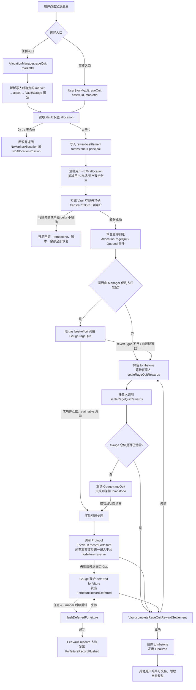

# V1 用户紧急逃生（Rage Quit）流程

> **名称与语义覆盖（2026-09-04）：** 本文现定义为用户即时 `rageQuit`，不是协议 Emergency。市场部署后永久自治，不存在市场级 PAUSED/RETIRED/EMERGENCY_EXIT 或 Recovery 管理状态；用户随时立即取回本金，奖励异步放弃并统一记入平台 forfeiture reserve。旧版 Emergency 术语仅为迁移审计索引。

## 1. 目的与不可变承诺

用户紧急逃生是**用户级别的本金退出机制**，不是市场级别的暂停、关闭或治理操作。它必须满足以下承诺：

- 用户发起后立即完成本金退出，不等待 24 小时，不受 `minimumAllocation` 限制，也不读取市场运行状态。
- 用户放弃本次仓位尚未领取的 Quote/Meme 奖励；这些奖励不属于退出用户，也不因存在其他 Active staker 而重新分配。
- 只影响发起用户自己的 STOCK allocation、Gauge 仓位及其奖励权益，不改变 Meme 代币、市场、Curve、Hook、LP、其他用户仓位或交易可用性。
- STOCK 转账必须是完整且精确的本金转账。若 STOCK token 转账失败或余额变化不精确，整笔交易回滚，账本和用户资产均不进入半完成状态。
- 奖励清理不是本金退出的前置条件。Gauge、FeeVault 或奖励记录失败时，不能回滚已经完成的本金退出；系统留下可观察、可重试的 settlement tombstone。

本文件只描述用户级 `rageQuit`。市场级状态、Controller、Emergency、Recovery 和 `forceReleaseAllocation` 已从当前架构删除；它们不属于本流程，也不是 `rageQuit` 的前置条件。

## 2. 两个入口

### 2.1 最强直接入口：`UserStockVault.rageQuit`

```solidity
UserStockVault.rageQuit(bytes32 assetUid, bytes32 marketId)
```

该入口由用户直接调用，`msg.sender` 就是退出用户。它只依赖 Vault 中已经存在的权威 allocation 记录和写入时确定的 asset-to-token 绑定，不依赖 AllocationManager、Gauge 是否可用，也不依赖市场状态。

它在同一笔交易内完成：

1. 校验调用者和 `assetUid`，读取 `allocation[assetUid][msg.sender][marketId]`。
2. 将该 allocation 写入 `rageQuitSettlementPrincipal` tombstone。
3. 清零用户-市场 allocation，并同步扣减用户总 allocation、市场总 allocation、资产总 allocation。
4. 从 Vault 的用户存款余额中扣减同额 STOCK。
5. 对 STOCK token 做精确余额差校验，将完整本金转入用户钱包。
6. 发出 `AllocationRageQuit` 和 `RageQuitRewardSettlementQueued` 等事件。

直接入口的奖励清理随后由用户、前端或任意 keeper 调用 `AllocationManager.settleRageQuitRewards` 完成。因 tombstone 已经存在，旧 Gauge 奖励不能被用户继续领取，也不能在同一市场重新建立 allocation，直到奖励清理完成。

### 2.2 便利入口：`AllocationManager.rageQuit`

```solidity
AllocationManager.rageQuit(bytes32 marketId)
```

该入口适合前端的单按钮操作。Manager 根据市场的写入绑定找到 Vault、Gauge 和 `assetUid`，然后严格执行“Vault 先行”：

1. 读取并确认 Vault 中的本金仓位存在。
2. 调用 `UserStockVault.rageQuitAllocation`，由 Vault 先记录 tombstone、清账并精确转出完整 STOCK 本金。
3. 本金交易成功后，以固定上限 gas 对 Gauge 执行 best-effort `rageQuit(user)`。
4. Gauge 成功且仓位已清零，则由 Manager 清除 Vault tombstone，流程在本交易内完成。
5. Gauge 调用失败、耗尽 gas、返回不一致，或 tombstone 清理失败，则保留 tombstone，发出 deferred 事件；本金仍然已经到账，后续可重试。

两个入口的核心安全性质相同：**本金退出先于任何奖励外部调用，奖励失败不能劫持本金退出。**

## 3. 完整业务链路



## 4. 按阶段说明状态变化

### 阶段 A：调用前

对用户 `u`、资产 `a`、市场 `m`，Vault 的权威状态可能是：

```text
allocation[a][u][m] = p > 0
allocated[a][u]      >= p
marketAllocated[a][m] >= p
totalAllocated[a]    >= p
rageQuitSettlementPrincipal[a][u][m] = 0
```

`p` 是本次必须完整退出的 STOCK 本金。系统不重新计算一个较小金额，也不因 `minimumAllocation`、unlock 时间或市场运行状态拒绝该全额退出。

### 阶段 B：本金优先提交

Vault 先把 `p` 写入 tombstone，再清理 allocation 聚合账本。之后执行精确 STOCK 转账：

```text
deposited[a][u]                 -= p
allocation[a][u][m]              = 0
allocated[a][u]                 -= p
marketAllocated[a][m]           -= p
totalAllocated[a]               -= p
rageQuitSettlementPrincipal[a][u][m] = p
STOCK(Vault)                    -= p
STOCK(u)                        += p
```

合约通过转账前后 Vault 与用户余额 delta 验证“实际减少/增加均为 `p`”。任何 token revert、返回值不是 `true`、Vault 减少量不等于 `p` 或用户增加量不等于 `p`，都会 revert；EVM 原子性会把之前的 tombstone 和账本写入一起回滚。

### 阶段 C：奖励清理窗口

本金转账成功后，tombstone 为非零，表示“本金已退出，但该用户奖励尚待最终处理”。在此窗口：

- `MemeStockGauge.consumeClaimable` 和 `settle` 通过 Manager 查询 pending 状态；pending 时拒绝旧奖励 claim/settle。
- Vault 的同一用户-市场 allocation 不能重新锁定，避免旧奖励与新仓位混淆。
- 不暂停市场，不冻结 Curve、Hook、LP，不修改 Meme 供应量，不修改其他用户的本金或交易。
- `AllocationManager.rageQuit` 的 Gauge 调用使用固定 gas 上限；Gas 不足只会导致延期，不会影响已到账本金。

### 阶段 D：Gauge 奖励结算

`Gauge.rageQuit(user)` 只处理该用户自己的 Gauge position：

- 清除 active/pending weight 和该用户未领取的 Quote/Meme reward。
- 无论退出时是否存在其他 **Active** staker、cohort 是否变化，退出用户未领取的 Quote/Meme 奖励都交给 `ProtocolFeeVault.recordForfeiture`，由 FeeVault 统一记入平台 forfeiture reserve；不得重新分配给任何 staker，后加入者也不能捕获旧 forfeiture。
- FeeVault 记录失败时，Gauge 保留 deferred forfeiture 计数，并允许任何人调用 `flushDeferredForfeiture()` 重试；该重试不受历史 Gauge emergency flag 影响，也不能恢复退出用户的奖励权益或改变分配归属。

Manager 只有在 Gauge position 的 active、pending、quoteClaimable、memeClaimable 均为零，并成功调用 `completeRageQuitRewardSettlement` 后，才删除 tombstone。

## 5. 失败与重试分支

| 分支 | 本金结果 | tombstone | 后续动作 |
| --- | --- | --- | --- |
| 无 allocation | 未转出 | 不写入 | 交易失败，提示用户无仓位 |
| STOCK token 转账 revert/返回异常/余额 delta 不精确 | 未转出 | 回滚为 0 | 修复 token/余额问题后重新发起 |
| Manager 的 Gauge 调用 revert | 已转出 | 保留 `p` | 任意人重试 `settleRageQuitRewards(m,u)` |
| Manager 因 gas reserve 跳过 Gauge | 已转出 | 保留 `p` | 在更充足 gas 下重试 |
| Gauge 返回 principal 不等于 `p` | 已转出 | 保留 `p` | 保留 pending，先排查账本不一致 |
| Gauge 已清零但 Vault tombstone 清除失败 | 已转出 | 保留 `p` | 任意人再次 settle；不会重复扣本金 |
| 延期期间 Active 权重或参与者变化 | 已转出 | 清理后删除 | 仍记入平台 forfeiture reserve，不向任何 staker 重分配 |
| 重复 rageQuit（tombstone 已存在且 allocation 已清零） | 无重复转出 | 保留原 tombstone | 等待 settlement，不允许重复退出 |
| FeeVault 记录 forfeiture 失败 | 已转出 | Gauge settlement 可完成；FeeVault deferred | 后续 permissionless flush 重试记录平台 reserve |

`settleRageQuitRewards(marketId, user)` 是幂等方向的恢复入口：它不会再次从 Vault 转移本金；只要 tombstone 存在，就检查/清理 Gauge，最后由 Vault 一次性删除 tombstone。若发现 Gauge 仓位与 tombstone principal 不一致，应保持失败并进入运维告警，而不是强行删除 tombstone。

## 6. 事件与可观测性清单

### Vault 事件

- `AllocationReleased(assetUid, user, marketId, amount, userMarketAllocation, userTotalAllocated)`：allocation 已从 Vault 账本清零。
- `StockWithdrawn(assetUid, user, amount)`：完整 STOCK 本金转出成功。
- `AllocationRageQuit(assetUid, user, marketId, amount)`：用户级紧急逃生本金完成。
- `RageQuitRewardSettlementQueued(assetUid, user, marketId, principal)`：奖励 settlement tombstone 已建立。
- `RageQuitRewardSettlementCompleted(assetUid, user, marketId, principal)`：tombstone 已删除，奖励清理完成。

### AllocationManager 事件

- `AllocationRageQuitExecuted(user, marketId, principal, quoteForfeited, memeForfeited, redistributed)`：便利入口的结果摘要；`redistributed` 为 ABI 兼容字段，当前实现恒为 `false`。
- `RageQuitRewardSettlementDeferred(user, marketId, principal, gauge)`：本金成功但本次 Gauge 清理未完成。
- `RageQuitRewardSettlementFinalized(user, marketId, principal, quoteForfeited, memeForfeited, redistributed)`：Gauge 清理与 Vault tombstone 清除完成；`redistributed` 为 ABI 兼容字段，当前实现恒为 `false`。

### Gauge / FeeVault 事件与视图

- `GaugeRageQuit(user, marketId, principal, quoteForfeited, memeForfeited, redistributed)`：Gauge 完成该用户仓位与奖励处理；`redistributed` 为 ABI 兼容字段，当前实现恒为 `false`。
- `ForfeitureReserved(marketId, user, feeAsset, amount, reserveBalance)`：退出放弃收益统一进入平台 forfeiture reserve 的 FeeVault 记账，不以 Active staker 数量分支。
- `ForfeitureReserveConverted(marketId, feeAsset, amount)`：reserve 按 FeeVault 规则转换/处理。
- `ForfeitureRecordDeferred(marketId, user, quoteAmount, memeAmount, totalDeferredQuote, totalDeferredMeme)`：FeeVault 本次记账失败，Gauge 已累计待重试金额。
- `ForfeitureRecordFlushed(marketId, quoteAmount, memeAmount)`：聚合的待记账金额已成功进入 FeeVault reserve。
- `MemeStockGauge.deferredForfeiture()`：检查 FeeVault 记账失败后仍待 flush 的 Quote/Meme 金额。
- `MemeStockGauge.flushDeferredForfeiture()`：任何人可调用的 reserve 记账重试入口，不受历史 Gauge emergency flag 阻断。
- `UserStockVault.rageQuitSettlementPrincipal(assetUid, user, marketId)`：检查待结算 tombstone principal。
- `AllocationManager.rageQuitSettlementPending(marketId, user)`：前端、keeper 和索引器使用的 pending 状态入口。

索引器将 `Queued → Deferred（可选）→ GaugeRageQuit → Finalized` 作为一条退出生命周期，并以 Vault 的 tombstone view 作为本金是否已退出的权威依据。前端在本金到账后立即显示“本金已取回、奖励已放弃、奖励清理待重试”，而不是显示用户仍在等待 24 小时。无特权 maintenance runner 的固定 `settle-rage-quit` 动作用 tombstone 事件中的 `marketId + user` 调用 Manager；`flush-forfeiture` 则补记 Gauge 聚合的 FeeVault reserve，二者都必须先模拟并以 triggerId 做幂等提交。

## 7. 核心不变量

实现和测试应持续验证：

1. **本金优先**：任何 Gauge/FeeVault revert、拒绝、不可用或 gas 不足，都不能阻止成功的 Vault 本金退出。
2. **精确转账**：成功退出时，Vault STOCK 减少量和用户 STOCK 增加量都严格等于原 allocation principal。
3. **账本守恒**：成功写入 tombstone 后，用户-市场 allocation 为零，用户/市场/资产聚合量同步扣减同一 principal。
4. **无奖励回领**：tombstone 存在期间，退出用户不能 claim 或 settle 旧 Gauge 奖励。
5. **无重复退出**：同一 allocation 只能产生一次 principal transfer；重试只处理 reward settlement。
6. **局部影响**：其他用户 allocation、Gauge position、奖励累计、Meme/Curve/Hook/LP 状态和交易路径不因某一用户退出而被暂停或改写。
7. **放弃收益归属正确**：任何 rageQuit forfeited Quote/Meme rewards 都进入 FeeVault 的 platform forfeiture reserve，不因 Active staker 或 cohort 状态重新分配，不能丢失、回到退出用户或被后来者捕获；ABI legacy `redistributed` 仅为兼容并恒为 `false`。
8. **可恢复**：tombstone 非零但奖励未完成时，任何人都能通过 `settleRageQuitRewards` 继续处理；只有确认 Gauge position 全清且 Vault 完成确认后才删除 tombstone。

## 8. 本地验证结果

- 根目录 `npm test` 是聚合验收入口，覆盖 60 项 Python 执行规范、全部 Foundry 测试、Backend、Indexer、Deployments、Maintenance Runner、正式 Web，以及 boundary、fixture、compiled interface、product artifact exact diff 与 CI 三轨漂移门禁；具体动态计数以当次 CI 输出为准。
- MultiAsset、Treasury 与 Vault/Gauge 三套状态不变量固定执行 256 runs、128,000 calls，并要求 0 handler revert。
- 当前十九模块 product manifest hash 为 `0xeb7b0a02f99afa8b27026abca7096f57d0491dd728318169a2eb8094bfd428cf`。

这些结果是本地实现与生成物一致性的证据，不等同于 RH 测试链部署、真实 RPC 全链路交易、独立第三方审计或生产灰度完成。
