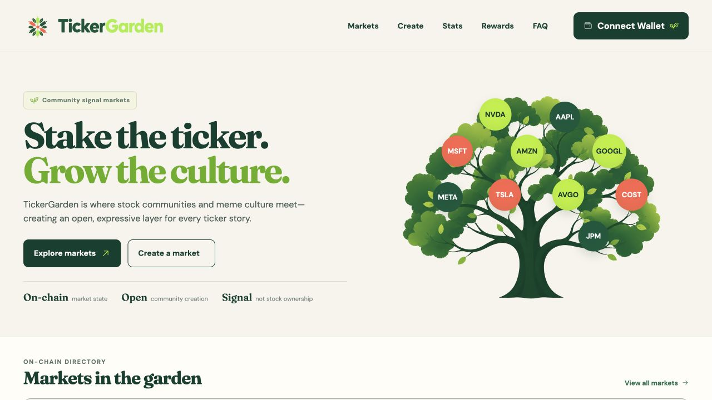
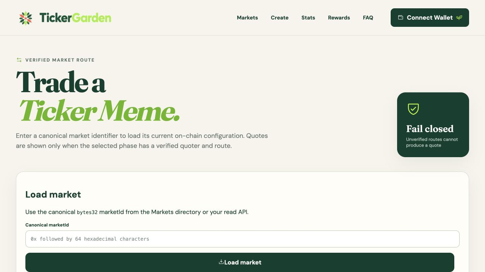
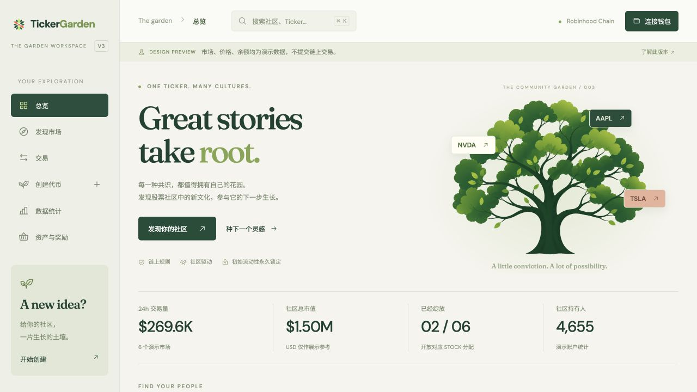
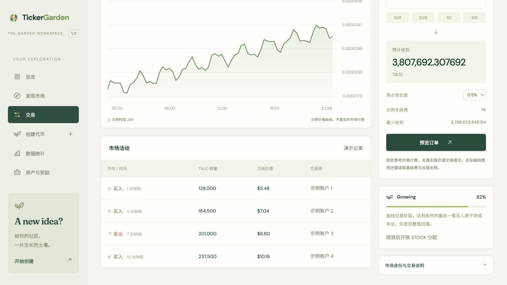
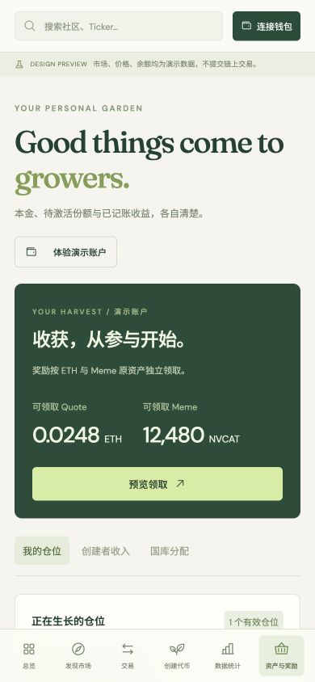

# V3 设计说明与参考审查

目标：延续 V1 的识别度，降低发现、交易与管理仓位的操作成本。V1 只读参考；不改变它的发布门、真实数据规则或安全语义。

## 本轮 V1 参考截图

### 1. 首页：品牌清晰，数据未配置时缺少探索内容

在本轮本地运行中，森林绿、奶油白、衬线标题和社区树形成稳定的品牌语言。下面的市场区域报告 read API 缺失。这个状态符合 V1 的真实数据边界，不能通过悄悄插入假行情“修复”。V3 作为明确标注的独立设计预览，使用演示目录来呈现完整信息结构；未来生产版本仍需独立的加载、错误、空数据与真实数据模式。

V3 把树上的 STOCK 做成生态筛选入口，引入左侧固定工作导航，保留主视觉但缩短品牌介绍占用，接续市场指标、可操作卡片和动态。只做了桌面截图观察，不能从中推断所有设备或辅助技术表现。

### 2. 交易入口：安全边界明确，默认操作需要技术知识

本轮画面要求用户输入 canonical bytes32 Market ID，且在加载前展示较大的说明和状态区域。对于从市场目录来的普通用户，输入内部标识增加操作成本。V3 以搜索/市场卡片建立上下文，默认直接打开对应市场，把身份和路由边界放到可展开说明中；不省略真实实现所需的 canonical 身份校验。

截图中不能验证真实报价、模拟、签名、失败恢复；本轮也没有真实部署配置。V3 预览不构成这些功能的验证。

## 设计取舍

- **保留品牌**：沿用已有树与 mark 的独立副本，以及奶油白、森林绿、青柠、衬线字体。没有照搬 V1 页面布局。
- **信息分层**：名称、STOCK、阶段与下一步操作放在第一层；技术身份、报价边界和国库证明说明可展开。
- **比较代替猜测**：同一视图比较市场体量、交易量、涨跌、阶段、分配资格，不提供收益承诺。
- **连续上下文**：全局搜索直达市场，卡片到交易继承选择。独立演示 ID 与真实 marketId 不混用。
- **逐步创建**：一次回答一个问题，默认模板控制复杂度，草稿持久化，最后总结费用与不变量。
- **收益与本金分开**：Quote/Meme 独立展示，空闲/有效/pending/解锁明确区分；紧急退出标明收益损失。
- **移动端**：底部六项导航，市场表格局部滚动，交易面板纵向排列，创建取消侧栏而保留完整表单。

## V3 结果

## 验收

六页均可导航；搜索/筛选/列表/对比、三步创建、订单预览、奖励数量验证与统计周期切换已实际在浏览器操作。390px 六页页面宽度均为 390px；没有 JS 错误。原生输入和对话框支持键盘操作，补充 skip link 和焦点样式。小字与辅助文案做了可读性调整，但没有完整屏幕阅读器或 WCAG 审计，不据截图宣称完全合规。
