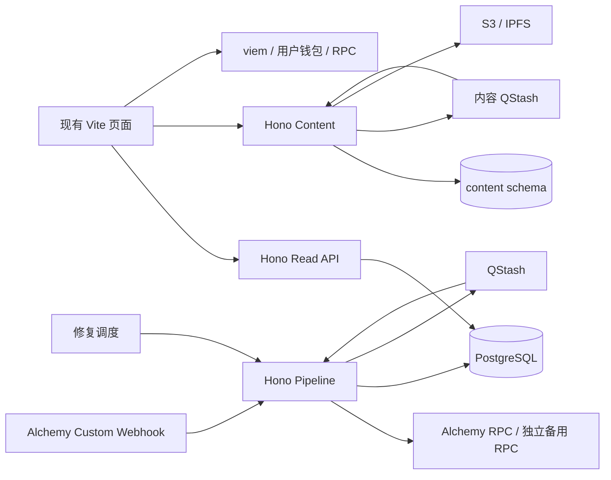

# TickerGarden V1 TypeScript Serverless 开发任务

> 日期：2026-09-10。依据：用户确认采用 TypeScript + Node.js + Hono，以及 Alchemy RPC + Custom Webhook；当前只实现正式前端所需功能，Go 后端作为改写参考。
>
> 状态：`LOCAL_IMPLEMENTATION_COMPLETE / EXTERNAL_VALIDATION_PENDING / NOT_PRODUCTION_READY`。
>
> 本文是本轮后端开发的唯一任务入口，包含技术方案、范围、依赖与验收。此前两份 Serverless 方案已移除；历史 Go 开发记录仅作参考，其全后端任务清单不自动进入本轮。
>
> 代码依据为当日包含未提交修改的工作树；不是某个 commit 的部署证明。TypeScript 服务、迁移和本地验证已实现；Preview 与外部资源尚未部署或验收。

## 1. 范围与交付原则

交付目标：`apps/web` 的首页、Explore、Trade、Create、Stake、Claim、Stats 获得真实、可恢复、有来源的数据与内容服务。当前路由和页面交互保持；Docs、法律页继续静态发布。`apps/web-v2`、`apps/web-v3` 和演示数据不定义本轮需求。

每个业务任务必须对应一个正式页面消费者，或者是该消费者必需的数据生产、正确性与运行保障。不得因为 Go 中已有命令、表、事件处理器或 OpenAPI 定义，就自动添加移植任务。

| 范围 | 本轮处理 |
| --- | --- |
| 市场与资产配置、搜索/筛选/分页、详情、成交、K 线、持有人、页面统计和展示价格 | 实现当前页面需要的字段与查询；按下面的消费者矩阵验收 |
| 用户仓位、本金账户、Creator/Holder 市场目录、Staker/Holder 奖励历史、交易与创建恢复 | 实现有消费者的只读数据；链上身份、模式、余额及实际可领取额由钱包操作前的 fresh RPC 再核验 |
| metadata 授权、图片和 JSON 持久发布、发布失败恢复 | 实现；属于 Create 的必要后端写入 |
| 链采集、动态合约发现、区间覆盖、重组恢复、增量投影、持久任务与刷新 | 实现上述页面数据所需部分；与公共查询分开执行 |
| Curve/Pool 报价、授权、创建、买卖、质押、领取、退出、签名和广播 | 沿用前端 viem 与用户钱包；本轮不新增后端签名或执行器 |
| Holder funding、运营维护、批量结算、Root 生成/发布/审核、Gas/nonce 自动管理 | 不移植到新服务；属于独立协议运行职责。存在外部依赖时在验收中明确，不能将未到账奖励显示为可领 |
| 旧 Treasury Merkle proof | 条件兼容，见第 3 节；不因辅助代码仍存在就重建 Root/TWAB 产品 |
| 用户偏好账户、运营 CMS、积分/空投、排行榜扩展、多链统一平台、通用 RPC 代理、WebSocket/SSE | 不在本轮；不为未来可能的功能先建服务或表 |

删除旧“方案”不等于删除 `services/backend-go` 代码、数据库或既有链上服务。改写期间保留 Go 作为参考及切换前的运行来源；本轮结束后，前端所需的新 API/内容/数据流水线必须能独立运行，不能由 Hono 转发 Go 请求来宣布完成。

## 2. 固定技术方案

| 层 | 选型 | 实现约束 |
| --- | --- | --- |
| 前端 | 现有 Vite + TypeScript，Vercel 静态部署 | 不为后端迁移改成 Next.js；保留钱包与前端路由 |
| HTTP 与任务入口 | TypeScript、Node.js `24.x`、Hono、Vercel Functions / Fluid Compute | 三个薄 Hono 应用；不使用 Edge Runtime、常驻循环或服务器本地状态作为持久化 |
| API 契约 | Zod + OpenAPI，生成 TypeScript client | 迁移前冻结当前 Go OpenAPI 和手写请求；目标由新服务维护唯一契约；Hono 类型推导不替代运行时校验 |
| 数据库 | Neon PostgreSQL + Drizzle ORM + `pg` | schema/migration 统一管理；复杂聚合可写参数化 SQL；连接池、查询超时、事务与最小权限必须实测 |
| 链访问 | `viem`，编译产物生成的 ABI，Alchemy 主 RPC + 独立供应商备用 RPC | 同块读取、部署/地址身份绑定、方法预算；服务端 RPC 密钥不进入浏览器包 |
| 链入口 | Alchemy Custom Webhook，以 GraphQL 过滤项目合约事件 | 入口只是提示；历史补采和完整性由 RPC 区间核验保证。目标网络订阅、过滤和投递能力在 TS-04 实测 |
| 可靠任务 | QStash `publish` + Flow Control；PostgreSQL inbox/outbox/jobs | 至少一次投递，业务提交幂等；不增加第二套队列框架 |
| 内容 | S3 上传暂存与不可变发布 + Pinata/IPFS | 图片直传、服务端验证后发布；数据库保存版本、摘要、CID 与状态 |
| 展示分析 | PostgreSQL 聚合与价格缓存；需要时接 Dune | Dune 只用于当前页面已需要的延迟历史统计；不作为资金、交易或领取资格来源 |
| 可选缓存 | Upstash Redis | 初期优先 CDN + PostgreSQL；只有实测限流/热点需要时引入，nonce 和任务幂等仍在数据库 |
| 验证 | TypeScript 类型检查、确定性单测、真实 PostgreSQL 集成、现有前端测试与浏览器链路 | Go fixtures 是参考之一；链上固定区块证据与独立计算用于判断正确性 |

Vercel 官方支持直接导出 Hono app，并支持 Node.js `24.x`；本方案显式锁定 Node 主版本，不依赖宽泛 `>=22` 的自动选择。连接池在模块作用域初始化，并按平台建议接入 `attachDatabasePool`；只共享无请求状态的 client/pool，不共享当前用户或可变任务上下文。[Hono 部署](https://vercel.com/docs/frameworks/backend/hono)、[Node.js 版本](https://vercel.com/docs/functions/runtimes/node-js/node-js-versions)、[连接池](https://vercel.com/kb/guide/connection-pooling-with-functions)、[Drizzle PostgreSQL](https://orm.drizzle.team/docs/get-started-postgresql)。

### 2.1 四个部署项目，共用一套 TypeScript 业务代码

| Vercel Project | 职责 | 凭据边界 |
| --- | --- | --- |
| `tickergarden-web` | `apps/web` 静态 SPA | 仅公开配置 |
| `tickergarden-read-api` | 页面只读 HTTP API | 已发布读视图 SELECT；有限只读 RPC；无队列、内容和账本写密钥 |
| `tickergarden-content` | 授权、上传、内容任务及状态查询 | content schema、内容专用 QStash、S3、Pinata；无链数据写权限 |
| `tickergarden-chain-pipeline` | Webhook、任务、采集、投影、发布、价格与统计刷新、修复调度 | 链数据和 job 写权限、RPC、分析来源；无链上签名私钥 |

一个 Project 内多个 handler 不能构成密钥隔离；按上表分配环境变量。数据库可为一个集群的不同 schema/角色，不要求四套数据库。生产、测试环境使用独立凭据和数据；Preview 默认固定 fixture 或隔离测试服务，不为每个 Preview 启动完整链索引。



已落地的目标目录如下：

```text
services/backend-ts/                 # 独立 npm workspace，根仓库不用同时重组
  package.json                       # workspaces: apps/*, packages/*；Node 24.x
  apps/read-api/src/index.ts          # export default Hono app
  apps/content/src/index.ts
  apps/pipeline/src/index.ts
  packages/contracts/                # Zod、OpenAPI、生成 client；纯 DTO
  packages/domain/                   # 当前页面需要的精确计算与验证
  packages/db/                       # Drizzle schema、SQL reader、migrations
  packages/chain/                    # ABI、部署校验、采集与投影
  tests/                             # unit、PostgreSQL integration、fixtures
apps/web/                            # 现有前端；同步契约与接入配置
```

三个后端 Project 各选自己的 app root；构建必须包含共享 workspace 包。平台 PoC 验证 monorepo 构建、ESM、包导出、生产依赖和 Node 版本，不能把目录存在视为部署可用。

### 2.2 Alchemy 接入与事件范围

选型已确认，账户配置与目标网络实测尚未完成。Alchemy Custom Webhook 支持用 GraphQL 过滤自定义合约活动，适合本项目的事件入口；普通 Address Activity 转账通知不能独立覆盖业务事件。每份订阅绑定一个 chain/network，具体开通能力在 TS-04 留存证据。[Alchemy Custom Webhook](https://www.alchemy.com/docs/reference/custom-webhook)。

| 环节 | 本轮实现要求 |
| --- | --- |
| RPC 适配 | 继续通过 `viem` 标准 HTTP transport 接入，不强制引入 Alchemy SDK。按目标 chain 验证历史读取、日志/回执、finalized 与同块读取；保留独立备用来源的配置和冲突处理 |
| 事件过滤 | 从受信任 Factory/Registry 和已发现实例出发，只订阅页面需要的创建、交易、Transfer、仓位、领取及配置事件；事件签名和 indexed 布局来自编译 ABI。不要订阅全链全部事件 |
| 动态地址 | 保存发现记录、出生块、过滤配置版本与生效范围；新地址自出生块补采，覆盖创建、mint、首买同块以及配置更新期间的空窗。只接受能绑定到受信任部署的日志 |
| 通知接收 | Hono 以原始请求体验签，校验订阅身份、环境与 payload schema，持久提交 inbox/job/outbox 后才确认。供应商事件 ID 用于接收去重，业务日志仍按第 4.1 节身份去重 |
| 完整性与恢复 | Webhook 用于提示待处理区间；RPC 按持久游标核验并推进覆盖。定时调度在没有推送时也检查链进度；通知的 sequenceNumber、最新块或空结果都不能代替覆盖与最终性证明 |
| 凭据 | 服务端 RPC key、每份 Webhook 的签名密钥和 QStash 签名密钥分开管理。若配置订阅需要 Alchemy 管理凭据，仅部署工具使用，不放入公共 API、前端或普通 worker |

历史回填使用有界 `eth_getLogs`、所需回执和固定块状态读取；Custom Webhook 的历史块测试不作为回填服务。按目标网络和套餐设置区块范围、响应体和 CU 预算，遇到超限拆分续跑。Alchemy 当前 Free 档 `eth_getLogs` 单次范围仅 10 块，不能仅根据月免费额度判断是否适合持续索引。[日志查询限制](https://www.alchemy.com/docs/chains/robinhood-chain/robinhood-chain-api-endpoints/eth-get-logs)。

QuickNode 不再是默认主 RPC 或必选事件入口；可作为独立备用 RPC 的候选。本轮不开发两套生产 Webhook 接收链路，也不依赖 Streams 完成历史恢复。

## 3. 页面消费者与接口范围

下表是实施起点。`TS-00` 须冻结精确 method、query、响应字段、错误码、调用条件及消费者文件；同族不同路径不能仅靠名字推断兼容。仅被生成而没有正式 caller 的方法不自动实现。表中未注明 POST 的 API 均为 GET；前端文件路径相对 `apps/web/src/`，任务中的 Go 包路径相对 `services/backend-go/internal/`。

| 页面 / 能力 | 现有 API 或数据来源 | 主要前端证据 | 任务 |
| --- | --- | --- | --- |
| 全站基础数据 | `/health`、`/v1/markets`、`/v1/markets/{marketId}`、`/v1/config/{kind}` | `app.ts`、`v1/readApi.ts`、`runtime/model.ts` | TS-00、05、06 |
| Home / Explore | 市场查询、目录、页面内 `/v1/market-statistics`；Home 与 Explore 的具体请求分开记录 | `app.ts`、`v1/explorePaging.ts`、`v1/directMarkets.ts` | TS-06、08、14 |
| Trade | `/v1/markets/{marketId}/detail`、`trades`、`holders`、`candles`；`/v1/market-display-statistics`、`/v1/market-statistics`；显示价格 | `v1/tokenDetailWidget.ts`、`v1/tradeWidget.ts`、`v1/candleWidget.ts`、`v1/holderWidget.ts` | TS-07、08 |
| Create | 配置与固定发布资产目录；`POST /launch-metadata/challenge`、`POST /launch-metadata`；`/v1/launch-recovery` | `create/upload-auth.ts`、`create/metadata.ts`、`v1/features/launch.ts`、`app.ts` | TS-06、11、12 |
| Stake | `/v1/users/{address}/accounts`、`positions`，市场/Gauge/Vault，`/v1/market-display-statistics` | `v1/stakingView.ts`、`v1/stakeStatistics.ts`、`app.ts` | TS-09 |
| Claim / Creator | `/v1/creator-markets`、当前与历史受益人；可领额和领取方式由链上读取 | `v1/creatorMarkets.ts`、`v1/creatorOwnership.ts`、`v1/features/userClaims.ts`、`app.ts` | TS-10 |
| Claim / Holder | `/v1/holder-markets`、`/v1/wallet-holder-markets`、`/v1/holder-reward-history`；链上 `rewardMode`、`claimableAssets` | `v1/holderMarkets.ts`、`v1/features/continuousRewards.ts`、`app.ts` | TS-10 |
| Stake / Staker 历史与活动 | `/v1/staker-reward-history`、`/v1/users/{address}/activity`；活动刷新仍请求 activity | `v1/userActivityWidget.ts`、`v1/userActivity.ts`、`app.ts` | TS-09、10、11 |
| 交易进度与创建恢复 | `/v1/transactions/{txHash}`、`/v1/launch-recovery`，浏览器 receipt | `v1/transactionObservation.ts`、`v1/transaction.ts`、`app.ts` | TS-11 |
| Stats / 全局组件 | `/v1/stats/overview`、`/v1/stats/series`、`/v1/stats/holders`、`/v1/protocol-statistics`、`/v1/statistics-prices`，当前还有全目录 market statistics 汇总 | `v1/globalStatsWidget.ts`、`v1/globalSeriesWidget.ts`、`v1/globalHoldersWidget.ts`、`v1/statsSummary.ts`、`app.ts` | TS-08 |
| 显示价格 | `/v1/prices/references`、`/v1/statistics-prices` | `v1/generated/read-api.ts` 的 `listDisplayPriceReferences`、`v1/statisticsValue.ts`、`app.ts` | TS-08 |
| 全站刷新 | `/v1/updates` | `v1/snapshotUpdates.ts`、`app.ts` | TS-05、13 |
| 静态页与深链 | `/docs`、`/privacy`、`/terms`、`/risks`；`/stake` 与旧 Rewards hash 路由 | `routing/routes.ts`、`security/headers.mjs`、`vite.config.js` | TS-14 |

### 3.1 调用条件与兼容项

- `VITE_INTEGRATION_BOOTSTRAP` 下的 `/v1/events`、`/v1/market-directory`、RPC origin 的 `/market-creation/{id}` 和 direct-chain 展示分支是测试兼容来源。正式迁移后使用标准市场/成交/创建恢复查询；保留测试能力时独立测试入口，不能将 `head` 改标签后装进 finalized DTO。
- `/v1/holder-maintenance-markets` 的已知 caller 是运营 worker，当前未发现正式前端 caller；不加入新公共 API，也不移植该 worker。
- `refreshTreasuryReward()` 当前仍含旧 Treasury 分支；新连续/双资产 Holder 路径直接链上读取，**不需要 Merkle proof 生成器**。默认本轮目标为当前连续/双资产模式。
- `TS-00` 必须对目标 release 的实际 `rewardMode`、前端 gate 和存量权利逐项核对。如果正式服务范围包含旧 Treasury 市场且已开放领取，将现有 `GET /v1/treasury/markets/{marketId}/epochs/{epochId}/claims/{account}` 纳入条件任务 `TS-L01`，供给外部已发布数据集；不得静默删除已有领取入口。若不包含，记录未启用证据，不扩展本轮为 Root 生命周期开发。
- 当前 Stats 页面固定 24h；helper 中的 All-time 分支不等于页面已经提供该功能。本轮完成实际 24h 和总量显示，不追加 All-time USD、排行或分析产品。
- 当前没有找到 `GET /v1/users/{address}/rewards` 和 `GET /v1/assets/{assetUid}/statistics` 的实际前端 caller，本轮不实现；全局 overview/holders/series 已有挂载消费者，必须实现。`getMarketStatistics` 生成方法未调用，但同一路径有手写 fetch，仍在必需范围。新 API 仅为消除页面全量扫描、完成分页或可恢复上传而增加，须有同时提交的消费者。

## 4. 所有任务共享的数据与正确性约束

### 4.1 最小读模型

只为第 3 节消费的数据建表，不照搬 Go 的全部迁移。建议按以下职责组织；具体表名在 TS-02 固定：

| 数据组 | 必要内容 |
| --- | --- |
| 部署和来源 | environment、chainId、deployment/ABI digest、受信任 Factory/Registry、动态地址与出生块 |
| 链与覆盖 | canonical block hash/parent、项目相关日志/回执引用、covered ranges、采集游标、重组 generation |
| 任务 | inbox、outbox、jobs、operationId、payload digest、lease/fencing、attempt、nextAttemptAt |
| 页面读数据 | 配置、市场与 metadata 身份、成交/K 线/持有人、账户目录/仓位/活动、展示奖励历史 |
| 发布与聚合 | publication pointer、scope revision、统计窗口/单位/覆盖、价格来源/时间/有效期、invalidation log |
| 内容 | 一次性 challenge、上传配额、上传/发布任务、对象 version/hash、CID、幂等结果 |

日志唯一身份至少包含 `(chainId, deploymentDigest, blockHash, transactionHash, logIndex)`，不能只用 transactionHash 去重；重组保留原始证据并通过 canonical/generation 排除孤块。

链金额使用 `bigint` 计算、JSON 十进制字符串、数据库精确整数（如 `numeric(78,0)` 并校验 uint256 上界）；地址与 hash 规范化，必要的有符号字段独立校验。价格使用定点/十进制计算；`currentMultiplier` 只应用一次，保留 raw/adjusted 标记。禁止用 JavaScript `number` 处理原始余额、累计费用和奖励。

### 4.2 finalized、展示与钱包执行

1. 现有标准同步契约保留 `revision = blockNumber:blockHash`，满足 `^[0-9]+:0x[0-9a-f]{64}$`。`assertFinalizedSync()` 还校验目标 chain、`status=synced`、`finality=finalized`；`deployment:<id>` 和 head 观察不属于此契约。
2. 市场/config/账户多次查询和分页绑定同一有效 publication；游标绑定筛选条件、稳定排序键、revision 和部署。旧 revision 失效按既有 reset/error 契约重读，不能混合两批数据。
3. 页面链头反馈可以沿用浏览器 receipt/RPC；不得发布为 finalized。区分来源区块时间、最终性观察时间与发布核验时间，不通过刷新 `publishedAt` 掩盖停滞。
4. 查询缺数据、缺覆盖、缺价格、来源冲突或过期时使用现有 unavailable/null/error 语义；完整覆盖确认的零值才能显示 0。不能把“未索引到”变成“没有市场/仓位/交易/收益”。
5. 新流水线只采集当前页面所需字段与事件，但必须完成这些字段的来源和覆盖校验。历史持有人需包含初始 mint、Transfer、协议地址排除；内部奖励转换不能算成用户买卖。所选契约要求回执完整性/根验证时，保留相同检查，不用 provider webhook 替代。
6. 不为本轮新建全协议运营财务引擎，也不能给未经证明的聚合加上“已对账”资格。普通资金 DTO 所承诺的同块状态、绑定、不变量与发布证据须真实满足；做不到的 scope 不可发布。展示型历史保留 `displayOnly`，不能控制可领额。
7. 用户操作继续核验链上 Factory/Registry 绑定、实际 reward mode、余额/授权和模拟。`/claim` 的直接本金退出继续只依赖固定 Factory 信任根与 RPC；API/队列/Dune 故障不能隐藏或误锁这个入口。
8. 新领取模式以当前合约与 ABI 为准：用户选择原币/兑换，Holder Quote/Meme 分资产。不得恢复旧 operator 批量转换和额外 7 天等待，也不得因后端迁移修改现有兑换参数、经济规则或链上权限。

### 4.3 Serverless 生命周期

- 公共 GET 只查询持久结果，不扫历史、不同步执行 Dune、不启动后台循环、不隐式写补采任务。交易状态允许固定范围、固定方法的只读 RPC 核验，不提供任意 RPC 代理。
- Webhook 验签后，将 inbox、job、outbox 一次事务提交，之后才返回成功；投递失败靠 outbox 恢复。同 ID 不同内容必须报冲突。
- worker 使用数据库 lease 与递增 fencing/generation；网络获取在短事务外，提交时再次核验 lease、chain/deployment、anchor、generation。结果、checkpoint 与完成状态原子提交。
- 重试和乱序到达不改变结果。Flow Control 限制投递并发，不替代数据库顺序与幂等；Cron 扫描 due jobs/outbox 负责修复，不假设 Cron 自动重试。
- 每次只执行有界区间/数据量，超预算拆分续跑。冷启动不重放全历史；checkpoint 有来源、版本和摘要，重启可恢复。禁止将 `setInterval`、未等待 Promise、`waitUntil` 或实例文件缓存当作可靠任务设施。
- Neon pooled connection 上使用短事务及事务级锁，不依赖 session 锁/状态。迁移单独用受限管理连接；每次部署或请求不得自动跑 migration。实例连接池上限、全局 worker 并发和数据库连接预算一起验证。

[QStash Flow Control](https://upstash.com/docs/qstash/features/flowcontrol)、[QStash 验签](https://upstash.com/docs/qstash/features/security)、[Vercel Cron 行为](https://vercel.com/docs/cron-jobs/manage-cron-jobs)。

## 5. 开发任务与依赖

任务状态以各项复选框和完成/进展记录为准。每项完成时记录修改文件、测试命令、fixture/真实环境证据及剩余限制；既有 Go 测试通过不能直接勾选新任务。依赖项完成的是可运行交付物，不只是接口桩。

### TS-00 — 冻结前端需求、部署身份与兼容契约

- [x] 交付：逐 caller 的 `frontend-api-scope` 矩阵，覆盖 generated client、手写 fetch、实际挂载 widget、测试与正式分支；记录路径、method、query、字段、状态码、页面、读取模式及任务归属。
- [x] 交付：目标 chain/release/Factory/Registry/ABI、起始块、reward mode、现有可用 API 证据；当前前端链常量与目标配置必须一致，不顺带扩展多链。
- [x] 验收：每个正式后端请求都有任务；无 caller 的路由标明排除；旧 Treasury 条件给出可复核结论；冻结当前响应 fixtures，不采纳旧文档与新源码冲突的行为。

完成记录（2026-09-10）：[`frontend-api-scope.md`](../backend/frontend-api-scope.md) 冻结正式、条件、测试与排除路由；[`typescript-serverless-baseline.json`](../backend/typescript-serverless-baseline.json) 锁定 5 个来源摘要、测试 release/部署图和链上实测 reward mode。`npm run check:typescript-serverless-baseline` 已通过。当前仅证明 Robinhood Testnet 范围，状态仍为 `NOT_PRODUCTION_READY`。

依赖：无。参考：`apps/web/src/app.ts`、`runtimeConfig.ts`、`routing/routes.ts`、Go `httpapi/router.go`、`openapi/v1.json`。

### TS-01 — Node/Hono 工程与平台最小链路

- [x] 交付：第 2 节 workspace、三个 Hono 入口、Node 24.x、ESM/strict TypeScript、独立 build/typecheck/test 命令及锁定依赖；统一错误映射、requestId、脱敏日志、参数/响应校验。
- [x] 交付：四个 Vercel Project 的配置模板与环境变量分类；精确 CORS、允许 method、请求体大小、超时和回调认证；read-api 的存活和 readiness 分开。
- [ ] 验收：本地构建不调用 Go；平台 Preview/testnet PoC 能加载共享包、完成数据库事务和签名回调；记录冷启动/并发请求，不将可部署等同于业务可用。

进度记录（2026-09-11）：`services/backend-ts` workspace、三个 Hono/Vercel 入口、共享 HTTP 层、四个 `vercel.json`、集中空值环境模板和锁文件已建立。根 workspace 及三个后端 app 均以 `engines.node=24.x` 固定运行时；`check:vercel-packaging` 按 Vercel monorepo 规则机械核对 25 个 workspace 的唯一包名、显式依赖、lockfile 登记、三个 app 的 Function 配置，并在 Node 24.19.0 下从各 Project Root 实际加载默认 `fetch` 入口。检查同时发现并补齐了此前依赖提升掩盖的 app/shared-package 直接依赖。`accept:preview` 已准备为部署后输出不含凭据的存活/readiness、精确 CORS、伪造签名拒绝及 10 路并发证据。42 项单测、7 项真实 PostgreSQL 集成测试、13 项恢复测试、TypeScript build 与本地打包前置检查均已通过。平台 Preview、真实签名 callback 及冷启动/并发证据仍需外部部署后完成，所以 TS-01 尚未整体关闭。

依赖：TS-00 的契约骨架。参考：Go `httpapi/`、`app/api.go`；不复制长驻进程装配。

### TS-02 — 最小 PostgreSQL schema 与精确类型

- [x] 交付：第 4 节所需 Drizzle schema、索引、唯一键、角色授权、migration；精确金额/地址/hash/time codecs，pool 与超时配置。
- [x] 交付：内容、read-api、pipeline 的数据库权限测试；环境/部署隔离、版本与不可变 publication 设计。
- [x] 验收：真实 PostgreSQL 覆盖回滚、唯一冲突、并发更新、超大整数和只读角色禁止写；查询有索引且不加载全快照；不导入整个 Go 数据库 schema。

完成记录（2026-09-10）：`packages/db` 固定部署、链证据、publication、市场、账户、成交、K 线、持有人、活动、回执、统计、价格、奖励、失效记录和内容对象的最小表及查询索引。migration 只可由管理命令显式执行，使用事务级迁移锁和 SHA-256 指纹；publication 有数据库级不可变触发器，指针用条件更新竞争。真实 test PostgreSQL 集成测试使用随机 schema/`NOLOGIN` 角色并在结束后清理，已覆盖迁移幂等、事务回滚、canonical 高度唯一冲突、并发指针仅一方成功、uint256 最大值/越界、read/content/pipeline 越权拒绝及 `markets_creator` 索引计划。`npm run test`（9 项）、`npm run build`、`npm run test:integration` 和 `npm audit --omit=dev` 均通过；未导入 Go 的运营、候选或财务编排表。

依赖：TS-00、01。参考：Go `migrations/`、`readmodel/models.go`；按字段需求选取。

### TS-03 — 可靠任务与内容任务隔离

- [x] 交付：inbox/outbox/jobs、dispatcher、lease/fencing、退避重试、dead 状态、受保护修复入口；任务只携带固定身份与范围，大对象保留 digest/ref。
- [x] 交付：链与内容各自的 QStash 目标、签名验证、Flow Control 和并发预算；固定 callback 白名单及部署保护兼容配置。
- [x] 验收：数据库提交前后、外部投递前后和 worker 提交前后崩溃均能恢复；重复/乱序/旧版本/过期 lease 不重复写入；无访客时任务也能前进。

完成记录（2026-09-11）：`packages/jobs` 与 `0001_core.sql` 实现事务 inbox/job/outbox、operation/payload 冲突检测、`SKIP LOCKED` 领取、递增 fencing/generation、指数退避、dead、过期 lease 修复和稳定 QStash deduplication ID。chain/content 共享表启用强制 RLS，以独立数据库角色和 queue policy 隔离；Vercel Cron 的签名 GET 每分钟修复并派发，不依赖页面访问，operator POST 使用独立 repair token。QStash 使用官方 `@upstash/qstash` 2.11.3，验签绑定原始 body、完整 callback URL、current/next key 和可选 region，目标 URL 只能来自代码注册表并限制为无凭据 HTTPS。失败 job 到期后会生成新的 outbox 投递，避免 QStash 自带重试耗尽后停滞。21 项单测、build/typecheck 及真实 PostgreSQL 集成测试已通过，覆盖相同 ID 同内容幂等、不同内容冲突、竞争领取、旧 fencing 拒绝、retry/dead、过期 job/outbox 回收、retry 重新投递、签名任务成功/重复以及跨 queue 不可见/不可写。当前配置没有真实 QStash token/signing key，未执行外部付费投递；平台实投与冷启动证据仍归 TS-01 的 Preview/testnet 验收。

依赖：TS-01、02。参考：Go `observationwork/`、持久 checkpoint 与 lease 模式；不移植运营执行状态机。

### TS-04 — 前端数据所需的链采集与恢复

- [x] 交付：Alchemy RPC transport、Custom Webhook GraphQL 过滤配置及版本记录、原始请求体验签与持久接收；管理凭据和运行凭据按第 2.2 节隔离。
- [x] 交付：目标部署的 Factory/Registry 发现、动态地址出生块补采、项目事件/区块覆盖、固定块 observations；Alchemy Webhook 提示和 RPC 区间补采统一一条路径，不依赖通知包含全部数据。
- [x] 交付：连续游标、parent/hash 校验、finalized policy、主备来源冲突处理、有界 backfill；共享区块获取，避免按用户/市场重复扫描。
- [x] 验收：空块、创建+mint+首买同块、同块新地址再发现、Curve→Pool、内部兑换归属、重复/缺失日志、断点续跑和重组均有 fixture；不以过滤后空 payload 证明完整覆盖。
- [ ] 验收：目标环境逐项验证 Custom Webhook 可创建、项目自定义事件过滤、真实签名投递与重投、订阅配置更新空窗恢复；伪造签名和未绑定来源不能入队。RPC 固定块读取、日志范围/响应限制、备用来源与停推后追赶留存证据；文档中的逐块通知能力不等于目标环境已验收。

进度记录（2026-09-11）：`packages/alchemy`、`chain`、`events`、`chain-worker` 与 pipeline 已形成验签 webhook → 事务 inbox/job/outbox → QStash 签名 worker → 双 RPC 有界采集路径。采集每次最多 10 块，批量读取日志，在创建块补读新 Token/Curve/Gauge，固定块核验代码哈希、parent/finality、覆盖摘要、checkpoint/generation，并支持有界共同祖先查找与 rewind；失败任务由 Cron 重新投递。事件 ABI 从冻结生成源生成并锁定摘要，内部 `f72` 文件/函数名只作兼容标识，不决定运行 release。真实 PostgreSQL fixture 已覆盖 block 5 空块、Factory 提示后从同一 birth block 补读 Token/Curve 的 mint/buy 类日志、主备缺失日志冲突、checkpoint 断点拒绝、rewind/reingest 与 generation 推进；analytics fixtures 覆盖 Curve、Pool、两类内部兑换、重复与异常 mint。当前 source-locked bootstrap 和运行代码一致绑定 activation block `117032526` / `0x36065fb09f78a00f75c528cad0e81e2f1a7b9f59bea9577488f26f4fb611f806`；此前 12 条 `MarketCreated` 和 32 个动态地址的双源结果属于历史 F72 QA，不能作为当前 release 的真实链验收。2026-09-11 使用 Node 24.19.0 重新执行当前 release 双源只读验证：chain/genesis/activation 一致，17 个固定合约代码哈希和 13 个 bootstrap 来源区块均通过；当前 baseline 没有冻结 QA 市场范围，事件验证明确记录 `deployment-and-bootstrap-only`、0 个 MarketCreated/动态源。证据见 [`typescript-serverless-current-release-verification.json`](../backend/typescript-serverless-current-release-verification.json)。42 项单测、build/typecheck 与 7 项 PostgreSQL 集成测试通过。Alchemy 管理配置和 inactive 创建脚本已准备；管理响应必须通过 schema 明确返回 `is_active=false`，否则脚本失败关闭；返回的 webhook ID/signing key 以原子替换写入当前 mode 0600 的 `.env.<profile>.local`，控制台不输出 signing key。Auth Token 已仅保存在被 Git 忽略、权限 0600 的本地测试环境文件；同日 dry-run 输出只含当前 release 和 query digest，并明确显示 network/callback 尚未配置，没有创建 Webhook。Notify `GET /api/team-webhooks` 只读实测返回 200，确认 Token 有效且团队当前为 0 个 Webhook；脱敏证据见 [`alchemy-notify-account-verification.json`](../backend/alchemy-notify-account-verification.json)。公开文档没有给出 Robinhood Testnet 的 Notify Create API 精确 network 枚举，现阶段不猜测写入，待 Dashboard/创建前校验取得精确值。尚缺公开 Preview callback、真实 QStash/Alchemy signing key，因此实际创建/测试/激活 webhook、平台冷启动/停推追赶和订阅切换空窗验收仍未执行，本任务保持未关闭。

依赖：TS-00、02、03。参考：Go `chainrpc/`、`journal/`、`discovery/`、`deployment/`、编译 ABI 与 `CanonicalBlockClock`。仅实现所选数据契约需要的解码/核验，遇到不支持的 Nitro 证据不能静默跳过。

### TS-05 — 增量读模型与一致发布

- [x] 交付：从已覆盖区间生成页面投影、同块状态补读、scope coverage、发布证据、publication pointer 与恢复 checkpoint；按 scope 显示可用性。
- [x] 交付：未最终确认分支恢复；异常 finalized 冲突先撤销资格并停止发布，再重建受影响数据；算法版本与重组 generation 独立记录。
- [x] 验收：多页/多请求同 revision 一致；来源篡改和部分更新不能发布；重启不回放全历史；同块修正不覆盖旧 revision，切换新版本在新发布块进行或先升级契约。

完成记录（2026-09-11）：新增不可变 `projection_records`、按 scope 的 projector checkpoint、锚点 publication 与原子 pointer；发布前强制验证 canonical/finalized 锚点、当前 reorg generation 及从 activation 起连续完整覆盖。签名 cursor 绑定 deployment/scope/revision/filter/稳定排序键；旧 revision 可继续一致翻页，孤儿锚点先删除 pointer 并写 invalidation。链 worker 在有界祖先搜索后 rewind，禁止越过 activation，并只在追平 finalized head 且市场事件确有变化时进行固定区块状态补读。兼容命名的市场投影交叉验证 Factory 事件、Registry/反向映射、Curve、Token、PoolKey/PoolId、路由端点和双 RPC 原始结果；历史 F72 QA 锚点 `116367276` 的 12 个市场结果只保留为算法对照，不作为当前 release 的链上完成证据。`npm run typecheck`、23 项单元测试、构建、ABI 生成检查及真实 PostgreSQL 集成测试通过。

依赖：TS-02、04。参考：Go `projection/`、`projector/`、`readmodel/store.go`、`candidate_store.go`；只改写本轮字段所需验证，不照搬整个财务候选编排。

### TS-06 — Home、Explore、Create 基础查询

- [x] 交付：health/sync、配置、市场列表/详情、metadata 身份；正式 Explore 的搜索、筛选、稳定排序及 cursor 分页，批量读取当前页展示字段。
- [x] 交付：Create 资产目录、已有市场绑定信息和不支持状态。
- [ ] 验收：关闭测试 bootstrap 后 Home/Explore 仍能从 Preview 的真实投影列出市场，Create 使用同一 revision 的资产和配置。
- [x] 交付：metadata 抓取的 gateway/HTTPS 边界、私网与重定向拒绝、响应大小和超时限制；外部 metadata 只影响展示，不覆盖链上地址、税率或部署身份。
- [x] 验收：多页大目录无重复/漏项；筛选变化使旧 cursor 失效；未知且完整覆盖的对象与暂不可用有区别；页面 GET 不执行历史补采。

进展记录（2026-09-11）：Hono Read API 已实现 `/health`、`/v1/markets`、`/v1/markets/{marketId}` 与 `/v1/config/{kind}`，读取 immutable publication，支持前端现有 market/asset/meme/phase/search/time 过滤、九种白名单排序和 revision-bound keyset cursor；完整 publication 中未知市场返回 404，缺 publication 返回 unavailable，GET 只读数据库。当前 release 的 8 条配置与 5 条资产从 source-locked 集成文件生成，状态事件在 covered range 上重放，未知新增配置或无法重建的资产变更停止发布；13 个来源区块已于 2026-09-11 通过当前双 RPC 只读复核。metadata loader 只允许显式 HTTPS origin/IPFS gateway，限制两次同白名单重定向、4 秒超时、JSON content type 和 256 KiB，并丢弃非白名单展示 URL。Hono/PostgreSQL 已覆盖市场搜索、详情、配置隔离、筛选变化 cursor 失效，以及 205 个市场中 102 个阶段筛选结果的跨页无重复/漏项；25 项单元测试及构建通过。真实 Preview 数据库追平和关闭前端 bootstrap 的浏览器验收尚未执行，因此 TS-06 保持未完成。

依赖：TS-00、05。参考：Go `httpapi/market_query.go`、`readmodel/`、`demandevents/directory.go`；前端 `explorePaging.ts`。

### TS-07 — Trade 详情、成交、K 线与持有人

- [x] 交付：TS-00 确认的 detail/trades/candles/holders 接口、对应分页/窗口/粒度、市场阶段与手续费展示；保持前端现有字段和精确单位。
- [x] 交付：Curve/Pool 成交统一归属，协议地址排除及持有人增量计数；没有成交与没有覆盖分开；K 线空桶按现有产品语义处理，不伪造交易。
- [x] 验收：买卖、毕业、同笔多事件和内部奖励兑换样本；固定块/窗口与独立 fixture 比较；切换市场与窗口后迟到响应不覆盖新页面；钱包报价和交易路线不依赖 K 线价格。

完成记录（2026-09-11）：新增数据库只读 `/v1/markets/{marketId}/detail`、`trades`、`candles`、`holders`，以 analytics checkpoint、canonical/finalized 连续区块和 revision-bound cursor 证明覆盖。增量 projector 从 activation 或前一 checkpoint 处理 Curve/Pool 成交和 Token Transfer；generation 改变时原子重建成交、持有人快照与手续费累计，协议地址保持排除。价格与 K 线全程使用整数/约分有理数；空桶为 null OHLC/零成交，没有成交只在完整覆盖后成立。FeeVault 的 `CurveFeesSwept`、`FeeBucketsCredited`、`HolderFeesAccrued` 按资产分别累计 creator/stakers/platform/holders，领取与兑换事件不重复记账。32 项后端单测、3 项真实 PostgreSQL 集成测试、后端 typecheck/build、当前 ABI/bootstrap 生成一致性检查及 308 项前端测试通过；样本覆盖 Curve 买卖、毕业后 Pool、同笔多事件、Pool fee、两类内部奖励兑换、窗口空桶、增量 holder 与详情手续费。前端既有代际/取消测试证明切市场和窗口后旧响应不会提交，直接钱包交易测试证明 Read API 不可用不阻断实时报价、模拟和签名。运行身份由当前 source-locked baseline 决定；内部 `f72` 兼容名称不构成另一发布身份。

依赖：TS-04、05、06。参考：Go `tokendetail/`、`analytics/`、`marketstats/`、`demandevents/market_display.go`；前端 `tokenDetail*`、`tradeChart.ts`、`recentTrades.ts`。

### TS-08 — 页面统计与展示价格

- [x] 交付：当前挂载的 protocol/market/global 统计和 series/holders 查询；24h 聚合、按 STOCK/Quote 的页面分组、market statistics 批量查询、Stake/Trade display statistics；必要时扩展现有聚合接口以替代 Stats 的全目录求和，不实现未使用的独立 asset statistics 路由。
- [x] 交付：独立价格刷新任务，明确来源、chain+资产地址、raw/adjusted、timestamp、validUntil、metric basis 与 coverage；缺失显示 null/Unavailable。
- [x] 验收：Stats 浏览器不为聚合拉完所有市场；不同 Quote 不直接相加；历史 USD 不用当前价格冒充；乘数恰好一次；零成交、部分覆盖、行情过期、Dune 失败分别测试。

完成记录（2026-09-11）：Read API 新增 `/v1/stats/overview`、`/v1/stats/series`、`/v1/stats/holders`、`/v1/market-statistics`、`/v1/market-display-statistics`、`/v1/protocol-statistics`、`/v1/prices/references` 与 `/v1/statistics-prices`。全局成交按 `assetUid + quoteAsset` 分组，原始 Quote、内部兑换和手续费资产始终分列；24 小时窗口必须具有 canonical/finalized 连续覆盖，空桶保留零流量且不生成成交。全局 holder 以所有市场协议地址的并集排除，并分别计算 market-address pair 与去重地址。Stats 主摘要改为一次读取服务端聚合，不再翻完市场目录或逐市场 RPC。`/v1/market-statistics` 同时兼容 Explore 的 `metrics/lastBuy` 与 Trade 的 `volume24hQuote/volumeObservedAt`；历史 USD coverage 缺失时 `volume24hUsd=null`，即使当前价存在也不冒充历史估值。

Pipeline 新增每分钟独立价格刷新：冻结当前 release 的 STOCK target，核对 Robinhood REST 的 chain/address/assetUid/symbol、active/pending multiplier、corporate action、halt、bid/ask 和时间，内部保留 raw bid/ask，公开 adjusted bid/ask、`currentMultiplier`、来源、单位、asOf/expiresAt/retrievedAt；乘数只应用一次。失败、过期或未刷新均返回 unavailable/stale，价格表和接口只用于展示。当前页面没有必须由 Dune 才能生成的字段，因此未引入同步 Dune 调用；任何可选历史 USD/Dune 数据缺失都沿同一 coverage 分支返回 null。34 项后端单测、3 项真实 PostgreSQL 集成测试、后端 typecheck/build、313 项前端测试通过，覆盖有效/过期价格、乘数精度、完整/缺口窗口、零流量、不同资产分组、费用累计、当前价存在但历史 USD 缺失，以及 Stats 不扫描目录。

依赖：TS-04、05、06；可与 TS-07 并行。参考：Go `marketstats/`、`displayprice/`、`analytics/`、`demandevents/protocol.go`、`display_time.go`、`market_display.go`；前端 `statsSummary.ts`、`statisticsValue.ts`、`stakeStatistics.ts`。

### TS-09 — Stake、本金账户与仓位显示

- [x] 交付：有消费者的用户 accounts/positions、市场与 allocation 关联、Stake 所需统计和活动入口；列表按用户/市场有界查询。
- [x] 交付：在一致区块读取所需 Vault/Gauge/Allocation 状态，处理 staking disabled、pending/active、退出清理；本金与奖励分开。
- [x] 验收：`allocated` 与其组成不能重复相加；切钱包、切链、切市场清理旧状态；存入/分配/质押/退出使用真实合约绑定与模拟；直接退出不被 Read API 故障阻断。

进展记录（2026-09-11）：新增 principal projector，全量重放已认证 `UserStockVault` 本金事件并逐事件检查 `deposited = allocated + free`、各 market allocation 之和等于账户 allocated；在同一 finalized block 由两个 RPC 对 Vault `deposited/allocated/freeBalanceOf/allocation`、Gauge `positionOf/activationSnapshot` 和 AllocationManager rage-quit settlement 做一致读取，任何 provider 分歧或账本分歧停止发布。`accounts` 和 `positions` 作为独立 immutable publication 发布，Hono 新增按 wallet 过滤、revision/cursor 绑定、最多 100 条的 `/v1/users/{address}/accounts|positions`。position 中 allocated 是本金总额，active/pending 仅为组成；processed activation 只移动组成，不重复增加 allocated；未决 rage quit 不伪装成普通仓位，完全清零仓位从当前列表移除，claimable 与本金保持独立。前端拒绝跨页重复 market，并完整校验 `free`、时间戳、Quote/Meme claimable 顺序、资产地址和 source block/transaction；source 不得晚于 finalized snapshot，同高度 block hash 必须一致。既有 generation/AbortController 清理和直接 Vault rage-quit 路径保持不依赖 Read API。42 项后端单测、7 项真实 PostgreSQL 集成测试、后端 typecheck/build、315 项前端测试与 production build 均通过；Stake 复用的用户 activity 已由 TS-11 落地。

依赖：TS-05、06；展示统计依赖 TS-08。参考：Go `principal/`、`rewards/positions.go`、`deployment/`；前端 `stakingView.ts`、`v1/features/vault.ts`、`app.ts`。

### TS-10 — Claim 目录与奖励历史

- [x] 交付：Creator 当前/历史受益人目录，Holder 当前/历史权益市场目录，wallet-holder 查询和 Staker/Holder 历史分页；返回历史覆盖、来源与展示属性。
- [x] 交付：识别已部署 mode/ABI，正确展示原币/兑换、Quote/Meme 和角色/epoch。纯历史累计不能替代链上 `claimable`；卖出后仍有已赚奖励的市场不能漏出目录。
- [x] 验收：Creator 变更、全卖出、双资产、跨 epoch、重复 claim 事件、mode 不匹配和 incomplete history；前端钱包执行当前 `claimUserRewards`/Holder 相应方法，不增加 operator 服务或旧等待流程。

完成记录（2026-09-11）：`history-projector` 从 activation 到 finalized anchor 重放认证日志，保存 Creator 历史受益人、Holder 注册市场、发生过 Transfer 的钱包候选、Staker/Holder 实付历史和地址关联 activity。`UserRewardsClaimed` 优先于同交易 `HolderStreamClaimed`，避免双记；Quote/Meme 分资产，已卖空钱包仍保留目录。新增 6 个数据库只读路由并接入生成客户端；Claim 的当前 claimable 和交易仍直接取链上状态。真实 PostgreSQL 集成覆盖目录、分页、双资产、同交易去重和 activity。

依赖：TS-04、05、06；账户字段与 TS-09 对齐。参考：Go `demandevents/creator.go`、`holder.go`、`holder_rewards.go`、`staker_rewards.go`、`rewards/`；`holderledger/` 仅在实际查询需要历史重建时选取。

### TS-11 — 用户活动、交易状态与创建恢复

- [x] 交付：实际挂载的用户 activity 及其分页/轮询、交易状态和 launch-recovery；交易观察与 finalized 历史分层，恢复返回明确覆盖与身份；不新增独立 activity-updates 接口。
- [x] 交付：有限只读 RPC 核验 pending/receipt，关联 sender、nonce、market、部署和相关事件；钱包本地保留未知结果交易的 hash。
- [x] 验收：成功、revert、未找到、已入块未 final、reorg、超时未知；“API 未找到”不得触发自动重复创建/发送；刷新/重连后恢复原交易，用户活动不将 v4 Pool sender 直接当用户。

完成记录（2026-09-11）：`transaction-observer` 只允许受限 transaction/receipt/head RPC，并结合 canonical/finalized journal 与保留的 orphan receipt 返回 unknown、pending、confirmed、finalized 或 reorged；unknown 不表示可以重发。sender/nonce/market 创建身份继续由前端已存在的本地 hash、Factory/Registry 回执恢复校验负责，服务端不扩大响应契约。activity 仅记录 ABI 事件中的地址角色，不把 Uniswap v4 Pool sender 当用户。38 项后端单测覆盖交易五态和冲突 fail-closed。

依赖：TS-04、05、06。参考：Go `transactions/`、`useractivity/`、`demandevents/recovery.go`；前端 `transaction.ts`、`transactionObservation.ts`、`userActivityWidget.ts`。

### TS-12 — Create 的可恢复内容发布

- [x] 交付：钱包 challenge/签名校验、原子消费 nonce、账户/Origin/chain/content digest 绑定、配额、尺寸/格式/像素验证；拒绝重放和跨内容复用。
- [x] 交付：版本化上传会话、S3 直传、完成校验、QStash pinning、发布状态查询；对象版本固定，JSON 与图片摘要/CID 持久记录；回取验证成功后才返回可用于创建的 metadataURI。
- [x] 交付：同步改造 `create/metadata.ts`、`upload-auth.ts`、发布进度和恢复。现有客户端等待 55 秒并要求直接返回 URI，不能只将服务端改成 202。
- [x] 验收：断网、重复 finalize、过期签名、对象被覆盖、provider 超时后恢复、相同内容重试得到同一结果；URI ready 前不能签创建交易；已有上链 URI 长期可取回。

完成记录（2026-09-11）：Content Hono 提供 challenge、session、complete、status 与签名 QStash worker。viem 恢复签名并绑定精确 Origin/chain/wallet/body SHA-256/nonce/expiry；S3 presigned PUT 后 worker 固定 version 并复核 digest、字节、PNG/JPEG/WebP 头和像素上限，再发布图片及 canonical JSON 到 Pinata。相同内容幂等返回同一 session；provider 临时失败恢复为 uploaded 供 durable job 重试。前端先等 ready IPFS metadata，才允许签创建交易。真实 PostgreSQL 集成和 19 项前端定向测试通过。

依赖：TS-01、02、03、06；可与链详情开发并行。参考：Go `content/auth.go`、`content/metadata.go`、`app/content.go`。目标接口见第 6 节。

### TS-13 — 更新接口、缓存与轮询收敛

- [x] 交付：预计算 `/v1/updates` 与 invalidation log，浏览器页面级请求合并、去重、取消和退避；account/market/revision/environment 进入正确的缓存键。
- [x] 交付：公共展示短 CDN 缓存；账户、领取资格、交易状态与内容授权使用 no-store；缓存失效/过期信息随响应可检查，不缓存 unavailable 为有效值。
- [x] 验收：unchanged 退避、失联恢复同 revision 强制重载、隐藏/离线停止、页面/账户切换拒绝迟到响应、receipt 后仅刷新相关 scope。当前 validator 固定要求 `pollAfterMs=5000`，先保持响应并在客户端退避；若改服务端字段，契约和 validator 同步升级。

完成记录（2026-09-11）：`/v1/updates` 只在 markets/configs/positions/accounts 四个 publication 共享同一 finalized revision 时比较 digest，返回 unchanged/changed/reset；旧 revision 不可比较时 reset。公开展示响应使用 5 秒浏览器、15 秒 CDN 和 30 秒 stale-while-revalidate，账户/奖励/交易/content 为 no-store。前端保持响应字段 5000ms，同时对 unchanged 和错误指数退避至 60 秒；重连立即刷新并拒绝旧 generation。

依赖：TS-05、06，并在 TS-07～12 各页面接入后回归。参考：Go `httpapi/updates.go`；前端 `snapshotUpdates.ts`、`statisticsCache.ts`、widget 生命周期。

### TS-14 — 正式前端接入与静态部署

- [x] 交付：前端使用新 API/content origin，移除正式页面对 test-only relay/direct 展示补采的依赖；钱包执行所需 RPC 保留。生成客户端与手写接口统一收敛。
- [x] 交付：Vercel 有效的安全头、CSP connect-src、CORS、静态资源与 HTML 缓存、SPA deep link；API 404 不落入 index.html。当前 origin parser 只接受完整 origin，不直接填 `/api` 前缀。
- [ ] 验收：首页→Explore→Trade、Create→恢复、Stake、Claim、Stats 全流程；移动端、换钱包/链、刷新深链及旧 `/rewards#positions|#staker|#activity` 到 `/stake` 兼容。hash 在客户端处理；当前 Vite `_headers` 不能代替 Vercel 配置验收。

进度记录（2026-09-11）：正式 caller 已统一使用 TypeScript OpenAPI 生成客户端或同一运行时配置，Creator/Holder、奖励历史、wallet-holder 和 launch recovery 均已接入；`apps/web/vercel.json` 固定 CSP、安全头、HTML/静态缓存和 SPA/API rewrite 边界。新增基于固定版本 `playwright-core` 和本机受信 Chrome 的 fail-closed 浏览器验收器 `npm --prefix apps/web run accept:preview:browser`。Node 24 本地 production Preview smoke 已覆盖桌面 1440×1024、移动 390×844 的 Home/Explore/Trade/Create/Stake/Claim/Stats，无横向溢出或首方请求失败；Create 草稿恢复、钱包连接、换账户、错链失效通过，未提交交易；旧 `/rewards#positions|#staker|#activity` 均保留 `marketId` 进入 `/stake`，Stake 单面板将旧 hash 规范化为 `#positions`。证据见 [`typescript-serverless-local-browser-verification.json`](../backend/typescript-serverless-local-browser-verification.json)。`check:client`、typecheck、315 项前端测试和 Vite production build 均通过。尚未部署 Preview，因此真实 API 市场发现、跨 origin、Vercel rewrite/响应头和部署环境深链刷新仍未验收，本项保持未完成。

依赖：TS-06～13。参考：`runtimeConfig.ts`、`routing/routes.ts`、`vite.config.js`、`security/headers.mjs`。

### TS-15 — 契约归属切换与 Go 对照验证

- [x] 交付：Zod/OpenAPI → 新 client 的唯一生成链；同步 `apps/web/scripts/sync-v1-read-client.mjs`、生成检查、根构建/测试/环境工具与 CI，不再从 Go 路径读取新服务契约。
- [x] 交付：固定同一 chain、deployment、block/hash、输入与时间窗口的 TypeScript/Go 对照；比较范围仅限本轮 API/投影。保留协议 ABI 生成的唯一来源，不手写替代产物。
- [x] 验收：新后端和前端在无 Go 服务、无 Go 二进制依赖下通过构建与联调；所有真实 caller 已覆盖。参考实现冲突以合约/ABI、独立计算和实际证据处理，不复制 Go 的请求内扫描或旧奖励逻辑。

完成记录（2026-09-11）：OpenAPI 3.1 和生成 client 的权威文件全部迁入 `services/backend-ts/openapi`，当前版本为 4.0.0；Creator/Holder、奖励历史也进入生成客户端，两个没有正式 caller 且服务端未挂载的遗留生成接口已删除。`check-contract-coverage.mjs` 机械核对 24 条生成 Read API、3 条冻结手写 Read API、4 条 Content API、Hono 挂载和前端生成副本；`test:contract` 已通过。根 offchain build/test、contract check 和 Node 24/PostgreSQL CI job 不调用 Go；根 `api:test`、`content:test` 及 `pipeline:test` 通过原生 Node HTTP 适配器启动对应 Hono app，旧命令名仅为兼容别名，非 Node 24 运行时会被拒绝。三套本地服务环境按 read/content/pipeline 最小权限筛选，不再把整个 `TG_*` 或另一服务的 QStash/S3/Pinata 凭据传入进程。本机 Node 24.19.0 已通过根环境入口分别启动 read-api、pipeline 和 content，三个 `/internal/live` 均返回 200；空依赖环境下 read-api `/internal/ready` 返回 503 并列出数据库/cursor 缺项。CI 的真实数据库变量使用 `TG_MIGRATION_DATABASE_URL`，执行 `test:integration` 与 `test:recovery`，避免静默 skip。运行时 baseline、Alchemy trigger、前端 bootstrap、Stock 配置与固定合约身份已统一为当前前端 release `0x5c2c656b…`、activation block `117032526`；旧 F72 名称只保留在冻结内部 projector/fixture 标识中，不再决定服务运行身份。各投影集成 fixture 对照市场、配置、本金、奖励、成交与 holder 语义；新服务没有请求内扫历史或旧 Treasury 执行逻辑。Go 目录仅作历史对照，当前 runtime switch 的数据库迁移已改为 TypeScript migration。

依赖：TS-00～14 的对应实现；对照 fixtures 在各任务开发时同步补充。参考：Go `scripts/generate-openapi.mjs`、`openapi/`、`testsupport/`、前端生成脚本。旧 Go 历史工具的契约和数据保留为版本化参考，不能与新服务双向生成形成两个权威源。

### TS-16 — 最小运行保障与实际成本验收

- [x] 交付：代码侧输出每任务耗时、Alchemy RPC 方法/标称 CU、Webhook 投递量与载荷字节、备用供应商用量、数据库连接、outbox age、checkpoint lag、缺覆盖、价格年龄、上传失败和重试指标；按链/部署/任务标识归因，不记录敏感 body/凭据。
- [x] 交付：队列/RPC/数据库故障恢复路径、PITR/对象版本恢复 runbook 和受保护修复入口。
- [ ] 验收：在 Preview 接入 Vercel/Alchemy/Neon/QStash/S3 实际指标和告警，记录 CDN HIT、账单 CU、连接峰值、回补速率、冷启动和容量报告，并确认告警可读。
- [ ] 验收：在约定样本下追赶速率高于新数据速度；记录真实调用/区块成本与预测账单；预算超限先限制历史/分析并发，不能丢弃已接收任务或跳过正确性检查。

依赖：TS-03～15。成本和验收建议值见第 7 节；不是未测的容量承诺。

进展记录（2026-09-11）：所有 Hono 请求已输出脱敏结构化耗时/状态/请求字节指标；RPC 逐 attempt 记录 provider label、method、请求/响应字节、耗时、结果和 retryable，不记录 endpoint/参数/响应；`alchemy-primary` 同时按带日期的官方 EVM 方法表记录 nominal CU 及表版本，备用供应商不误套 Alchemy 计价，错误调用和最终账单以 Dashboard 为准。Alchemy callback 记录已验签 webhook ID、载荷字节与 duplicate，chain/content job、QStash dispatch 和价格刷新记录结果与耗时。chain/content 的受保护 `/internal/metrics` 返回 job/outbox 状态、最老待投递年龄和 PostgreSQL pool；pipeline 还返回 ingestion/projection generation、checkpoint age/lag、未解决 source conflict、价格年龄/过期，content 返回 upload 状态/年龄/失败数。42 项单测、7 项真实 PostgreSQL 集成测试和 13 项 `test:recovery` 已通过。恢复、告警阈值、容量采样项和 2026-09-11 官方价格快照见 [`V1_TYPESCRIPT_SERVERLESS_OPERATIONS.md`](./V1_TYPESCRIPT_SERVERLESS_OPERATIONS.md)。真实 Preview 冷启动、Alchemy 账单 CU、Neon 连接峰值、CDN HIT 与预测账单仍需部署后采样，因此 TS-16 不关闭。

### TS-17 — 可回滚切换与最终页面验收

- [x] 交付：代码/ABI/manifest/schema/契约版本清单、旧数据迁移或从部署起点重建策略、shadow 对照、切换与回滚 runbook。已有 metadata URI、账户历史及未决交易恢复必须连续。
- [x] 交付：新流水线的数据库 generation、drain 检查、推进 fencing 和旧任务拒绝机制；保留数据库兼容窗口，回滚不恢复 orphaned 数据。
- [ ] 切换：在真实环境 drain 旧流水线、推进 generation、原子发布指针并切前端 origin；确认旧实例不能写入新 generation。
- [ ] 验收：关闭 Go 前端服务后当前正式页面仍独立工作；本轮所有必需任务与条件任务关闭。只有本地检查时记录本地完成；真实网络、外部服务与上线批准各自保留状态，不把文档确认当作生产发布授权。

依赖：TS-14、15、16；若 TS-L01 被触发则同时依赖其完成。

进展记录（2026-09-11）：[`V1_TYPESCRIPT_SERVERLESS_OPERATIONS.md`](./V1_TYPESCRIPT_SERVERLESS_OPERATIONS.md) 固定四项目、版本清单、从 activation 重建、shadow、drain/fencing、origin 切换和不删除 orphan evidence 的回滚顺序。新增向后兼容的 `0002_queue_generation_fence`：chain/content 各有数据库 active generation，入队、领取、修复、派发均同时校验运行环境代际并持共享锁；受保护推进接口只允许加一，并在排他锁事务中要求旧 generation 的 job 全部 `succeeded`、outbox 全部 `sent`，`dead` 也会阻断。operation/external ID 带 generation，chain continuation 继承 lease generation；旧实例在推进后不能接收或领取新代际任务。增量 migration、未成功 drain 拒绝、推进成功、旧 worker/旧 enqueue 拒绝、新 worker 领取及 queue RLS 已通过 7 项真实 PostgreSQL 集成测试。真实外部推进、callback/alias 与前端 origin 切换、页面浏览器验收和 Go 服务关闭仍未获得部署授权，因此第二项和最终验收保持未完成。

### TS-L01 — 旧 Treasury 已开放领取的条件兼容

仅当 TS-00 证明目标服务范围包含该能力时执行。实现精确契约的只读 proof 查询与持久数据集读取，绑定 chain/distributor/market/epoch/account/root/datasetHash；前端本地重建 proof 并核验链上 root/claimed。数据集未发布、无资格、来源冲突与服务故障分开。外部 Root 数据生产者及责任明确；不移植生成、签名或发布器。若该依赖未满足，不得声称这些旧市场的领取功能已迁移完成。

结论（2026-09-11）：TS-00 锁定的当前 `0x5c2c656b…` 范围为双资产 Holder V4，`legacyTreasuryProofOriginConfigured=false` 且旧 Treasury 写批准未配置，本条件未触发。

### 5.1 开发顺序与里程碑

| 阶段 | 任务 | 阶段可验收结果 |
| --- | --- | --- |
| M0 | TS-00～02 | 范围、契约、身份、工程和数据库基础可复核；尚不能称页面服务完成 |
| M1 | TS-03～06 | 真实数据从采集到发布再到 Home/Explore 的纵向链路；不是固定 JSON 演示 |
| M2 | TS-07～12 | Trade/Stats、Stake/Claim、Content 三组可并行；共用数据与任务基础 |
| M3 | TS-13～15 | 完整前端接入、缓存/轮询、生成契约与独立 TypeScript 构建；Go 对照完成 |
| M4 | TS-16～17 | 故障/恢复/成本/目标环境验收与可回滚切换；实际批准后才能发布 |

不得在 TS-04/05 没有真实供数时，先将生产前端切换到返回空数据的 API。过渡期可以读已验证、固定格式的 Go 导出供联调，但最终验收必须关闭此依赖。

## 6. 必要的新接口与兼容窗口

以下为目标设计，在 TS-00/12 固定 schema；不是当前已存在接口。

| 目标接口 | 用途与限制 |
| --- | --- |
| `POST /v1/content/challenges` | 对 metadata + image digest/size/type 的确定性摘要签名授权，绑定钱包、chain、前端 origin、过期时间和一次性 nonce |
| `POST /v1/content/uploads` | 验证授权、原子登记会话和配额，返回 uploadId、受限直传信息与状态访问凭据；相同 operation 返回相同结果 |
| `POST /v1/content/uploads/{uploadId}/complete` | 校验所有权/摘要/对象 version，原子登记发布 job/outbox；成功返回 202 和 jobId，不表示 URI 已可用 |
| `GET /v1/content/jobs/{jobId}` | 校验会话访问凭据，返回 pending/validating/publishing/ready/failed；只有 ready 返回验证过的 URI |
| 现有 protocol/market statistics 的必要扩展 | 一次请求返回当前 Stats 所需聚合和完整性，代替浏览器全市场求和；先扩展现有契约，不创建重复统计服务 |

现有 `/launch-metadata/challenge` 与 `/launch-metadata` 同步协议只在旧前端兼容窗口保留；与新版客户端一起切换。授权摘要的 canonical JSON/图片身份必须前后端一致，不能改变 body 后仍使用旧签名。S3 签名 URL 过期前可能复用，所以固定对象 version，并在后台重新校验字节摘要/真实格式；不能只信浏览器 MIME 和上传成功通知。旧上链 `/launch-metadata/{digest}.json` 地址有真实使用时保留稳定读取/映射，不能随服务切换失效。

## 7. 验收命令、预算与完成定义

在 `services/backend-ts/package.json` 执行以下门禁。`typecheck`、`build`、`check:generated`、`test:unit`、`test:integration`、`test:contract` 与 `test:recovery` 均已定义；后两项已分别通过本地契约检查和真实隔离 PostgreSQL 恢复检查。每项记录只能写实际执行结果：

```text
npm --prefix services/backend-ts run typecheck
npm --prefix services/backend-ts run build
npm --prefix services/backend-ts run check:generated
npm --prefix services/backend-ts run check:vercel-packaging
npm --prefix services/backend-ts run test:unit
npm --prefix services/backend-ts run test:integration
npm --prefix services/backend-ts run test:contract
npm --prefix services/backend-ts run test:recovery
```

现有前端门禁继续使用，并在 TS-15 切换 client 来源：

```text
npm --prefix apps/web run check:generated
npm --prefix apps/web run typecheck
npm --prefix apps/web test
npm --prefix apps/web run build
npm run check:boundary
```

`test:integration` 必须使用真实隔离 PostgreSQL；`test:contract` 覆盖 generated 与手写 caller 的正常/异常响应；`test:recovery` 覆盖重复投递、函数终止、重组、版本切换和内容恢复。固定区块 RPC 只读核验与受控钱包 E2E 分开记录；本地假 RPC/fixture 不能替代目标链验收。合约源码未变不要求为文档跑完整 Foundry；后续如改变 ABI、合约或部署工具，执行仓库对应门禁。

初始工程预算：普通查询硬预算 5 秒，单个后台步骤目标不超过 20 秒并留出提交时间；同区 origin 查询 P95 目标 500 ms，RPC 确认 finalized 后页面投影 P95 目标 15 秒。以上是待压测目标，平台 `maxDuration`、QStash timeout、RPC/数据库超时取兼容配置，不能以平台最大时长代替任务拆分。

此前讨论的 **约 600 美元/月** 是含 QuickNode 套餐的早期预算参考，不作为切换 Alchemy 后的新报价、固定成本或费用上限。按 2026-09-10 官方定价，Alchemy Free 为每月 3,000 万 CU；PAYG 前 3 亿 CU 按 $0.45/百万 CU、超过部分按 $0.40/百万 CU。若月计费用量为 1 亿 CU，对应 CU 费用约 $45；此例不代表本项目实际总账单，不能把 CU 当成请求次数或直接等同于 QuickNode credits。[Alchemy 定价](https://www.alchemy.com/docs/reference/pricing-plans)。

TS-16 分别测量正常增量、首次回填、断流追赶的 RPC 和 Webhook 用量，按实际账户计费规则汇总，再加独立备用 RPC、Vercel、Neon、QStash 和存储费用。测算假设单链、单生产环境、受控任务批次与前端流量；工程/审计、付费 Dune/行情、Gas 和税单列。验收报告须记录 DB CU-hour、队列投递含重试、CDN 请求与对象存储，不能仅用 RPC 请求数估算全部费用。[Vercel 定价](https://vercel.com/pricing)、[Neon 定价](https://neon.com/pricing)、[QStash 定价](https://upstash.com/pricing/qstash)。

最终完成必须同时满足：

- [ ] 本轮所有正式页面消费者覆盖完整，未通过删除已启用功能或伪造空值缩减范围。
- [ ] TypeScript 服务独立供数；公共读取没有隐藏历史扫描、Dune 执行、Go RPC 转发或本地文件持久化。
- [ ] 对应字段的来源、覆盖、数值、finalized 和分页一致性通过验证；重试/重组不重复计数或发布错误资格。
- [ ] 钱包身份/模式/模拟、直接本金退出、当前用户选择领取和内容恢复保持正确；旧市场权利按实际范围处理。
- [ ] 前端/后端生成物、类型、构建、集成与浏览器验证完成；成本、恢复及目标环境限制如实记录。
- [ ] 切换和回滚可执行，部署/生产批准状态单独记录。

## 8. Go 参考的使用规则

只改写“输入 → 明确输出”的必要查询、解码、数值与验证逻辑，先写独立 fixtures 再实现。`testsupport` 是纯测试参考，既不能作为生产服务入口，也不能直接转成整个后台服务。对照时固定 block/hash、ABI、部署与时间；旧文档、旧 fixtures 与当前用户领取模式冲突时更新契约依据并补回归，不复制旧行为。

优先参考 `httpapi`/`readmodel` 的查询契约、`demandevents` 的目录与展示语义、`content` 的授权/内容验证、`marketstats`/`tokendetail` 的统计口径以及 `chainrpc`/`deployment` 的身份校验。请求触发 RPC 补写、进程内 map/goroutine、全快照 replay、本地 CID 回执和本机绝对 manifest 路径都必须改成第 4 节的持久、有界模式。

保留已有 Go 代码作为可审查来源；不用“Go 实现过”标记 TypeScript 已实现，也不将 Go 历史全量后台验收清单加入本轮前端服务任务。

## 附录：当前代码证据入口

| 证据 | 用途 |
| --- | --- |
| [前端主流程](../../apps/web/src/app.ts)、[路由](../../apps/web/src/routing/routes.ts) | 页面实际挂载、手写请求、Claim/Stake/Stats 当前行为 |
| [生成 client](../../apps/web/src/v1/generated/read-api.ts)、[client 同步脚本](../../apps/web/scripts/sync-v1-read-client.mjs) | 已有标准 DTO；当前唯一来源为 TypeScript OpenAPI，Go 契约仅作冻结对照 |
| [运行配置](../../apps/web/src/v1/runtimeConfig.ts)、[同步校验](../../apps/web/src/runtime/model.ts)、[刷新器](../../apps/web/src/v1/snapshotUpdates.ts) | origin、能力 gate、finalized/revision 与 5000 ms 兼容 |
| [用户领取](../../apps/web/src/v1/features/userClaims.ts)、[连续 Holder](../../apps/web/src/v1/features/continuousRewards.ts)、[旧 proof](../../apps/web/src/v1/features/treasury.ts) | 当前领取模式与条件兼容的真实路径 |
| [上传授权](../../apps/web/src/create/upload-auth.ts)、[metadata 客户端](../../apps/web/src/create/metadata.ts) | 签名 body、nonce、55 秒同步协议与 URI 校验 |
| [Go HTTP 路由](../../services/backend-go/internal/httpapi/router.go)、[服务装配](../../services/backend-go/internal/app/api.go) | API 到 reader 的接线和条件挂载 |
| [TypeScript OpenAPI 生成器](../../services/backend-ts/scripts/generate-openapi.mjs)、[权威 OpenAPI](../../services/backend-ts/openapi/v1.json) | 当前唯一生成链；Go 路径仅保留兼容入口 |
| [Go 按需数据源](../../services/backend-go/internal/demandevents/service.go)、[页面聚合](../../services/backend-go/internal/demandevents/protocol.go) | 展示语义与需要去除的请求内补采/内存状态 |
| [Go 领取观察](../../services/backend-go/internal/rewards/positions.go)、[Go 内容验证](../../services/backend-go/internal/content/metadata.go) | candidate/display 与资格边界、内容改写参考 |
| [当前领取规则](./V1_REWARD_CONVERSION.md)、[合约 ABI 生成](../../apps/web/scripts/generate-v1-abis.mjs) | Go 历史行为冲突时的核对依据 |
